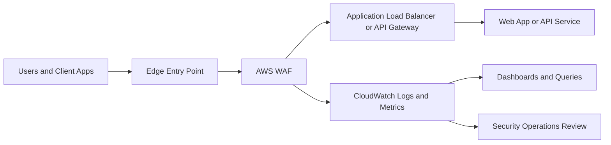

# Public Web App WAF Logging Architecture

## Overview

This reference architecture shows a practical pattern for protecting a public web application while preserving enough logging and telemetry for tuning, triage, and customer reporting.

## Architecture Goals

- inspect inbound web traffic before it reaches the application
- centralize WAF decision logs for analysis and reporting
- provide operational visibility for blocked, counted, and allowed requests
- support phased rollout from baseline to enforcement

## Reference Flow

## Control Placement

### Edge Protection

- Apply WAF protections at the internet-facing entry point
- Use managed rules for baseline coverage
- Add rate limiting and geo controls based on threat model and business footprint
- Use explicit IP allow and block lists only where operationally justified

### Logging and Visibility

- Send WAF logs to a centralized logging destination
- Build dashboards for top rules, blocked requests, and count-mode findings
- Preserve enough context to investigate false positives and targeted abuse

### Application Coordination

- Share recurring WAF findings with the application team
- Map recurring exploit attempts to application-level remediation work
- Track which risks are being mitigated at the WAF versus in the app itself

## Key Tradeoffs

- Strict blocking reduces risk faster, but increases false-positive pressure during rollout
- Count mode improves tuning confidence, but leaves more malicious traffic reaching the app
- Broad exceptions reduce noise quickly, but can create blind spots if not carefully scoped

## Recommended Advisory Message

Use the WAF as a fast-moving control layer for exposure reduction and operational visibility, but pair it with application fixes, logging discipline, and a documented tuning process. The best architecture is one that can both block attacks and explain why decisions are being made.
